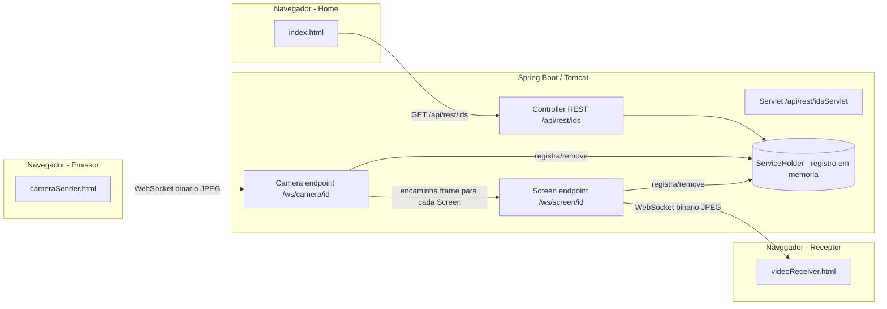
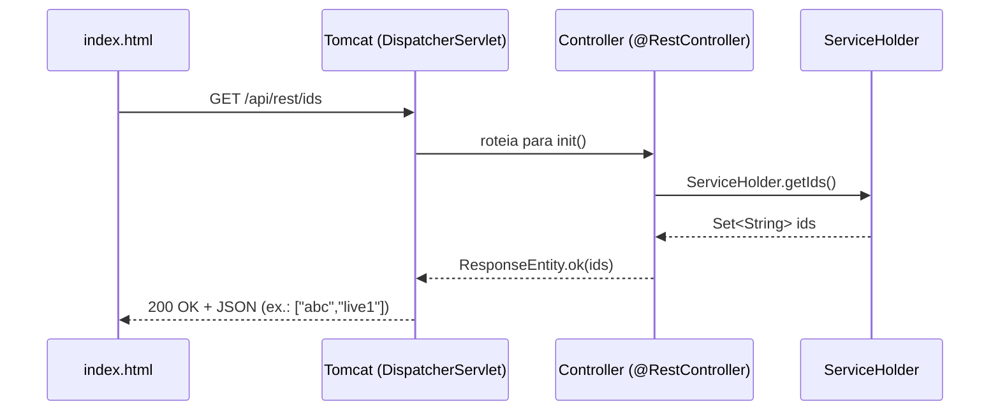
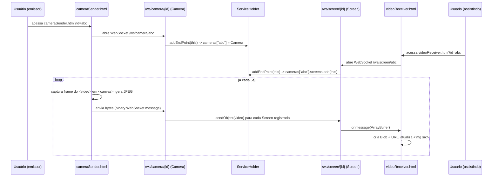
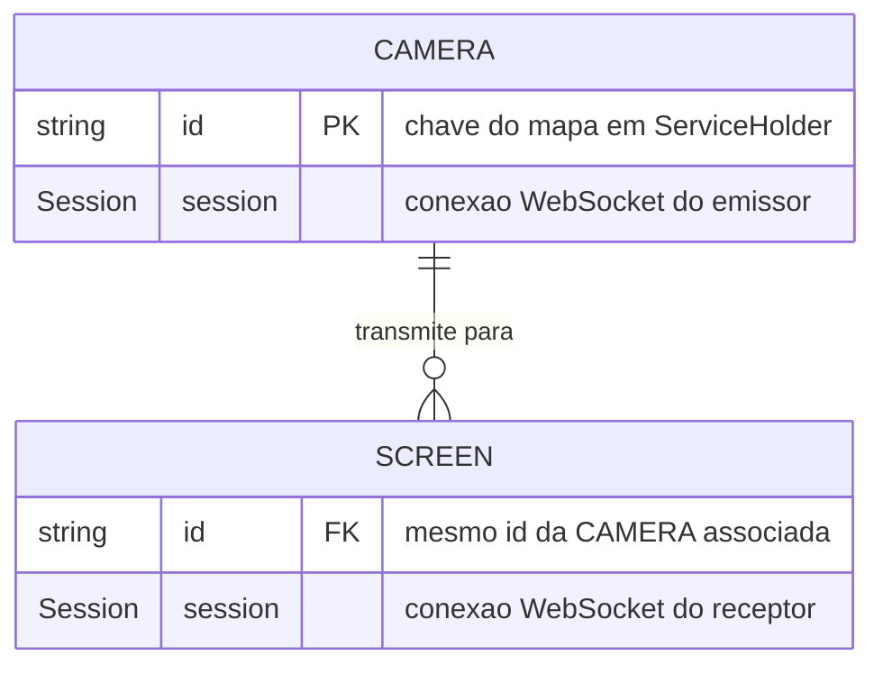

# Arquitetura do VideoSharer

Este documento explica como o **VideoSharer** foi construído, para servir de referência aos projetos finais da turma. A ideia central do sistema é permitir que uma "câmera" (quem transmite) envie frames de imagem em tempo real para uma ou mais "telas" (quem assiste), usando **WebSocket** para o tráfego de vídeo e **REST** apenas para consultar quais transmissões estão ativas.

## 1. Visão geral e stack tecnológica

- **Comunicação em tempo real**: WebSocket puro (Jakarta WebSocket / `javax.websocket`), não é usado STOMP/SockJS.
- **Frontend**: HTML + JavaScript puro (sem framework), 3 páginas estáticas servidas de `src/main/resources/static`.
- **Sem banco de dados**: tudo é mantido em memória (`Map`/`List` estáticos), ou seja, o estado se perde a cada reinício do servidor.
- **Sem streaming de vídeo real**: o sistema **não** transmite um fluxo de vídeo contínuo (não usa codecs de vídeo, RTP, HLS, WebRTC, etc.). Em vez disso, ele captura *fotos* (frames JPEG) periodicamente da câmera do navegador e as envia como mensagens binárias via WebSocket. Do lado de quem assiste, essas fotos vão trocando o `src` de uma ``, dando a impressão de um vídeo "em baixo FPS" (efeito *slideshow*).

| Camada | Tecnologia | Observação |
|---|---|---|
| Linguagem / runtime | Java 17 | `<java.version>` no [pom.xml](pom.xml) |
| Framework | Spring Boot 4.1.0 (`spring-boot-starter-parent`) | apenas para DI (`@Component`) e MVC REST |
| Servidor de aplicação | Apache Tomcat | via `spring-boot-starter-tomcat` (escopo `provided`) e imagem `tomcat:10.1-jdk17` no Docker |
| Empacotamento | WAR (`<packaging>war</packaging>`) | permite rodar dentro de um Tomcat externo (necessário para `@ServerEndpoint` funcionar como descrito na seção 6.6) |
| Tempo real | Jakarta WebSocket (`spring-boot-starter-websocket`) | endpoints anotados com `@ServerEndpoint`, sem STOMP/SockJS |
| Frontend | HTML5 + JavaScript vanilla | `getUserMedia`, `Canvas`, `WebSocket`, `Blob`/`URL.createObjectURL` |
| Estilo (frontend) | Tailwind CSS + DaisyUI via CDN | usado só em `index.html` |
| Persistência | **Nenhuma** | estado mantido em `Map`/`List` estáticos na JVM |
| Build/CI | Maven (`mvnw`) | `mvn clean package` gera o `.war` |
| Deploy | Docker multi-stage (ver seção 8) | imagem final roda `catalina.sh run` |

## 2. Diagrama de componentes



## 3. Estrutura de pacotes

```
com.devcaotics.videoSharer
├── VideoSharerApplication.java   # classe main (@SpringBootApplication)
├── ServletInitializer.java       # ponto de entrada quando roda como WAR num Tomcat externo
└── webSocket/                    # pacote único concentrando toda a regra de negócio
    ├── GeneralEndpoint.java       # classe base (ciclo de vida @OnOpen/@OnClose/@OnError)
    ├── Camera.java                # endpoint WS do emissor + broadcast para as telas
    ├── Screen.java                # endpoint WS do receptor
    ├── ServiceHolder.java         # registro estático em memória (quem está conectado a quem)
    ├── Controller.java            # REST — GET /api/rest/ids
    ├── Servlet.java               # mesma função do Controller, via HttpServlet puro
    ├── WebSocketConfig.java       # (tentativa de) configuração do ServerEndpointExporter
    └── ByteEncoder.java           # encoder binário não utilizado atualmente
```

Note que **não existe** separação em pacotes como `controller`, `service`, `repository`, `model`/`entity` — tudo fica junto em `webSocket`. Isso funciona para um projeto pequeno e didático, mas não é a organização recomendada para um projeto maior (ver seção 4 sobre camadas e seção 11 sobre pontos de atenção).

### Fluxo de uma requisição REST (`GET /api/rest/ids`)



Não existe camada de *service*/*repository* nesse fluxo: o `Controller` chama diretamente o método estático de `ServiceHolder`, que atua como fonte de dados.

## 4. Camadas

O projeto não segue uma arquitetura em camadas "clássica" (Controller → Service → Repository → Entity/DB). O que existe, na prática, é:

| Camada conceitual | Onde aparece no código | Responsabilidade |
|---|---|---|
| **Apresentação** | `index.html`, `cameraSender.html`, `videoReceiver.html` | UI, captura de mídia, exibição de frames, chamadas REST/WebSocket |
| **API / Comunicação** | `Controller`, `Servlet` (REST) e `Camera`, `Screen` (WebSocket) | Recebe requisições HTTP/WS e traduz para chamadas ao estado da aplicação |
| **Domínio / Estado** | `ServiceHolder`, `GeneralEndpoint`, `Camera` (lista de `Screen`s) | Regra de negócio: quem está transmitindo, quem está assistindo, broadcast de frames |
| **Persistência** | **Inexistente** | Não há repositório nem banco — o "armazenamento" é a própria memória da JVM (ver seção 6) |

Ou seja, `ServiceHolder` acumula responsabilidades que num projeto maior estariam divididas entre um **Service** (regra de negócio) e um **Repository/DAO** (acesso a dados). Isso é aceitável numa prova de conceito, mas é importante que a turma reconheça essa simplificação antes de replicá-la num projeto com mais entidades/regras (ver seção 11).

## 5. Backend — pacote `com.devcaotics.videoSharer.webSocket`

### 5.1 `GeneralEndpoint` (classe base)

Classe abstrata que concentra o ciclo de vida comum a qualquer endpoint WebSocket (câmera ou tela):

- `@OnOpen`: guarda o `id` (vindo da URL, ex.: `/ws/camera/{id}`) e a `Session`, e se registra no [ServiceHolder](src/main/java/com/devcaotics/videoSharer/webSocket/ServiceHolder.java).
- `@OnClose` / `@OnError`: remove o endpoint do `ServiceHolder`.

`Camera` e `Screen` **herdam** de `GeneralEndpoint` — é assim que os dois compartilham a mesma lógica de registro/remoção sem duplicar código (padrão *Template Method* simples via herança).

### 5.2 `Camera` — [Camera.java](src/main/java/com/devcaotics/videoSharer/webSocket/Camera.java)

```java
@Component
@ServerEndpoint("/ws/camera/{id}")
public class Camera extends GeneralEndpoint {
    private List<Screen> screens = new ArrayList<>();

    @OnMessage(maxMessageSize = 5000000)
    public void transmitVideo(Session s, byte[] video) {
        screens.forEach(screen -> screen.getSession().getBasicRemote().sendObject(video));
    }
}
```

- Endpoint WebSocket ligado à URL `/ws/camera/{id}`.
- Mantém a **lista de `Screen`s** conectados a esse mesmo `id` (quem está "assistindo" aquela câmera).
- Toda vez que chega uma mensagem binária (um frame JPEG enviado pelo `cameraSender.html`), o método `transmitVideo` **retransmite** o mesmo array de bytes para todas as telas cadastradas. Esse é o núcleo do "broadcast" (padrão *Observer*: a câmera é o *subject*, as telas são os *observers*).

### 5.3 `Screen` — [Screen.java](src/main/java/com/devcaotics/videoSharer/webSocket/Screen.java)

```java
@Component
@ServerEndpoint("/ws/screen/{id}")
public class Screen extends GeneralEndpoint {
}
```

- Endpoint ligado à `/ws/screen/{id}`. Não tem `@OnMessage` próprio porque **não recebe** nada do cliente — ele só existe para guardar a `Session` que a `Camera` usa para enviar (`getSession().getBasicRemote().sendObject(video)`).

### 5.4 `ServiceHolder` — [ServiceHolder.java](src/main/java/com/devcaotics/videoSharer/webSocket/ServiceHolder.java)

Repositório **estático** em memória, funciona como um *registry*:

```java
private static final Map<String, Camera> cameras = new HashMap<>();
```

- Chave = `id` da transmissão (definido pelo usuário no formulário do `index.html`).
- Valor = a instância de `Camera` conectada com aquele `id`, que por sua vez guarda a lista de `Screen`s.
- `addEndPoint(GeneralEndpoint)` / `byeEndpoint(GeneralEndpoint)`: fazem `instanceof` para decidir se é `Camera` (adiciona/remove do mapa) ou `Screen` (adiciona/remove da lista dentro da `Camera` correspondente).
- `getIds()`: retorna o `Set<String>` de ids de câmeras ativas — usado pela home page para listar as transmissões ao vivo.

> ⚠️ **Ponto de atenção para quem for usar como referência**: `HashMap` e `ArrayList` **não são thread-safe**, e o WebSocket container chama esses callbacks em threads concorrentes. Em um projeto sério isso deveria virar `ConcurrentHashMap` / `CopyOnWriteArrayList` (ou sincronização manual) para evitar `ConcurrentModificationException` sob carga.

### 5.5 Exposição via REST — duas formas equivalentes

O projeto tem **duas implementações redundantes** do mesmo endpoint `GET /api/rest/ids` (provavelmente para fins didáticos, mostrando duas formas de expor a mesma informação):

- **[Controller.java](src/main/java/com/devcaotics/videoSharer/webSocket/Controller.java)** — abordagem "moderna" com Spring MVC (`@RestController`), retorna JSON automaticamente (Jackson serializa o `Set<String>`).
- **[Servlet.java](src/main/java/com/devcaotics/videoSharer/webSocket/Servlet.java)** — abordagem "clássica" com `HttpServlet` puro (`@WebServlet`), monta a string JSON manualmente concatenando aspas simples (funciona, mas não é JSON válido por usar `'` em vez de `"` — cuidado se for copiar esse padrão).

Ambos delegam para `ServiceHolder.getIds()`.

### 5.6 `WebSocketConfig` e `ByteEncoder`

- **[WebSocketConfig.java](src/main/java/com/devcaotics/videoSharer/webSocket/WebSocketConfig.java)**: registraria o `ServerEndpointExporter`, bean necessário para que o Spring Boot habilite endpoints anotados com `@ServerEndpoint` quando rodando em container embutido. Note que a classe **não está anotada** com `@Configuration` nem o método com `@Bean` — hoje ela não tem efeito nenhum; o que faz os endpoints `@ServerEndpoint` funcionarem é o `@Component` em `Camera`/`Screen` (que o Spring já escaneia) mais o suporte a Servlet 3.0+ / `spring-boot-starter-tomcat` rodando como WAR. Se for reaproveitar essa classe num projeto novo, lembre de adicionar `@Configuration` no topo e `@Bean` no método.
- **[ByteEncoder.java](src/main/java/com/devcaotics/videoSharer/webSocket/ByteEncoder.java)**: implementação de `Encoder.Binary<ByteBuffer>` que não é referenciada em nenhum `@ServerEndpoint` (o atributo `encoders` não é usado). Está no código mas sem efeito prático hoje — os endpoints enviam `byte[]` diretamente via `sendObject`.

## 6. Frontend — `src/main/resources/static`

### 6.1 `index.html` — página inicial / lista de transmissões

1. Ao carregar (`onload="load()"`), faz `fetch` em `GET /api/rest/ids` e recebe a lista de ids de câmeras ativas.
2. Para cada id, clona um card de template (`#card`) e cria um link para `videoReceiver.html?id=<id>`.
3. Tem também um formulário para o usuário digitar um novo id e ser redirecionado para `cameraSender.html?id=<id>`, iniciando uma transmissão nova.
4. A página tem um `<meta http-equiv="refresh" content="20">`, ou seja, recarrega sozinha a cada 20s para atualizar a lista (nada de polling via JS).

### 6.2 `cameraSender.html` — quem transmite (emissor)

Fluxo em `init()`:

1. Lê o `id` da query string (`?id=...`).
2. Abre `new WebSocket("wss://.../ws/camera/{id}")` e espera o evento `onopen`.
3. Pede acesso à câmera com `navigator.mediaDevices.getUserMedia({video: {...}})` e exibe no elemento `<video>`.
4. Cria um `<canvas>` **em memória** (não precisa estar no DOM visível).
5. A cada **5 segundos** (`setInterval`):
   - Desenha o frame atual do `<video>` no `<canvas>` (`drawImage`).
   - Converte o canvas em um `Blob` JPEG (`canvas.toBlob(..., 'image/jpeg', 0.9)`).
   - Converte o `Blob` em `ArrayBuffer` e envia como `Uint8Array` pelo WebSocket (`socket.send(...)`).
6. Ao fechar a aba (`beforeunload`), fecha o socket.

> Existe um bloco de código antigo comentado no arquivo usando `MediaRecorder` + `MediaSource` (tentativa anterior de streaming real de vídeo em chunks WebM). Foi abandonado em favor da abordagem mais simples de enviar frames JPEG isolados — vale a pena ler os comentários para entender o motivo da escolha (streaming de vídeo real e sincronização de `MediaSource` é significativamente mais complexo).

### 6.3 `videoReceiver.html` — quem assiste (receptor)

Fluxo em `init()`:

1. Lê o `id` da query string.
2. Abre `new WebSocket("wss://.../ws/screen/{id}")` — **mesmo `id`** usado pelo emissor, é isso que conecta as duas pontas dentro do `ServiceHolder`.
3. `socket.binaryType = 'arraybuffer'`.
4. A cada `onmessage`:
   - Recebe o `ArrayBuffer` com os bytes JPEG.
   - Cria um `Blob` do tipo `image/jpeg` e gera uma URL local (`URL.createObjectURL`).
   - Atribui essa URL ao `src` de uma `` — trocando a imagem exibida a cada frame recebido.
   - Libera a URL anterior (`URL.revokeObjectURL`) para não vazar memória.

## 7. Sequência completa (do clique até a imagem aparecer)



## 8. Esquema de dados ("banco de dados")

O projeto **não usa banco de dados** — não há `application.properties` com datasource, nem JPA/Hibernate, nem `spring-boot-starter-data-*` no [pom.xml](pom.xml). Todo o "estado persistente" vive apenas na memória do processo Java, dentro de `ServiceHolder`, e é perdido a cada restart.

Mesmo assim, dá pra descrever o **modelo conceitual** dos dados como se fosse um esquema, porque isso ajuda a enxergar como ele se transformaria em tabelas reais caso a turma queira acrescentar persistência:



Tradução do diagrama para o código atual:

- `Map<String, Camera> cameras` em `ServiceHolder` faz o papel de "tabela `CAMERA`", com `id` como chave primária.
- `Camera.screens` (uma `List<Screen>`) faz o papel de "tabela `SCREEN`", com um relacionamento implícito 1‑N pela referência em memória (não existe uma FK explícita, é só a lista dentro do objeto).
- Não há campos como `criado_em`, `titulo`, `status`, nem qualquer outra informação persistida — só o necessário para rotear o WebSocket.

> Se a turma for implementar algo que precise sobreviver a um restart (histórico de transmissões, usuários cadastrados, etc.), o caminho recomendado é trocar esse `Map` estático por entidades JPA reais (`@Entity`) e um `Repository` (`JpaRepository`), e não tentar "salvar" o `Map` em disco manualmente.

## 9. Uso do Dockerfile

O [Dockerfile](Dockerfile) usa **multi-stage build**, separando a etapa de compilação da etapa de execução para gerar uma imagem final menor e sem o JDK/Maven:

```dockerfile
# Etapa 1 - Compilação
FROM maven:3.8.5-openjdk-17 AS build
WORKDIR /app
COPY . .
RUN mvn clean package -DskipTests

# Etapa 2 - Execução
FROM tomcat:10.1-jdk17
RUN rm -rf /usr/local/tomcat/webapps/*
COPY --from=build /app/target/*.war /usr/local/tomcat/webapps/ROOT.war
EXPOSE 8080
CMD ["catalina.sh", "run"]
```

- **Etapa `build`**: usa uma imagem com Maven + JDK 17, copia todo o código-fonte (`COPY . .`) e roda `mvn clean package -DskipTests`, gerando o `.war` em `target/`. Os testes são pulados (`-DskipTests`) para acelerar o build da imagem — isso é aceitável em ambiente de deploy simples, mas não substitui rodar os testes no CI antes de gerar a imagem.
- **Etapa final**: parte de uma imagem **limpa** do Tomcat 10.1 (compatível com Jakarta EE 9+/`jakarta.*`, necessário aqui pois o projeto usa `jakarta.websocket.*` e `jakarta.servlet.*`), remove a webapp padrão (`ROOT` do próprio Tomcat) e copia o `.war` gerado na etapa anterior renomeando-o para `ROOT.war` — isso faz a aplicação responder na raiz do domínio (`/`) em vez de em `/VideoSharer`.
- `EXPOSE 8080` documenta a porta usada pelo Tomcat; o `server.port` do [application.properties](src/main/resources/application.properties) lê a variável de ambiente `PORT` (`${PORT:8080}`), pensada para plataformas como Render/Heroku que injetam essa variável — mas repare que isso só tem efeito quando a aplicação roda via **Spring Boot embutido**; rodando como WAR dentro do Tomcat da imagem final, quem manda na porta é o `server.xml` do próprio Tomcat (padrão 8080), então a variável `PORT` fica sem efeito nesse cenário Docker.
- `CMD ["catalina.sh", "run"]` inicia o Tomcat em primeiro plano (necessário para o container não encerrar imediatamente).

Para rodar localmente:

```powershell
docker build -t videosharer .
docker run -p 8080:8080 videosharer
```

## 10. Tabela de padrões de projeto usados

| Padrão | Onde aparece | Como está implementado | Está "correto" ou é simplificação didática? |
|---|---|---|---|
| **MVC** | `Controller.java` (papel de Controller) + `index.html`/HTML estáticos (papel de View) | Parcial: não há um "Model" de domínio rico — o `Controller` devolve direto o `Set<String>` do `ServiceHolder` | Simplificação: um MVC completo teria um `Model`/DTO próprio em vez de expor a coleção interna diretamente |
| **DAO / Repository** | `ServiceHolder.getIds()`, `addEndPoint()`, `byeEndpoint()` | **Não existe DAO/Repository de verdade** — `ServiceHolder` mistura acesso a dados com regra de negócio, e os "dados" são só um `Map` em memória, não um banco | Simplificação forte: não replicar esse acúmulo de responsabilidades num projeto com banco de dados real; separar `Service` (regra) de `Repository` (acesso a dados/`JpaRepository`) |
| **Facade** | `ServiceHolder` funciona como uma fachada simples para `Controller`/`Servlet`/`Camera`/`Screen`, escondendo o `Map` interno | Métodos estáticos (`addEndPoint`, `byeEndpoint`, `getIds`) escondem a estrutura de dados de quem chama | Uso razoável do conceito, mas por ser tudo `static` perde os benefícios de injeção de dependência/testabilidade de uma Facade real (um `@Service` injetável) |
| **Singleton** | `ServiceHolder` (campos e métodos `static`) | Não é um Singleton clássico (sem instância única controlada, sem construtor privado) — é um "Singleton estático" via classe utilitária | Simplificação: funciona para uma única instância da aplicação, mas não escala para múltiplas instâncias atrás de um load balancer (cada uma teria seu próprio estado) |
| **Observer / Pub-Sub** | `Camera.transmitVideo()` percorre `screens` e envia a mensagem para cada uma | `List<Screen>` como lista de observers, notificação manual via `forEach` | Implementação manual e funcional, mas sem desinscrição automática em caso de erro de envio (o catch está vazio) |
| **Template Method (via herança)** | `GeneralEndpoint` define o ciclo de vida (`@OnOpen`/`@OnClose`/`@OnError`) reaproveitado por `Camera` e `Screen` | Herança simples, sem métodos abstratos que forcem a subclasse a implementar algo | Uso razoável para o tamanho do projeto |
| **POST/Redirect/GET (PRG)** | **Não é usado** — o formulário de `index.html` trata o submit **inteiramente em JavaScript** (`event.preventDefault()` + `location.href = ...`), não existe um POST real ao servidor | N/A | Não há necessidade de PRG aqui porque não há um POST de formulário tradicional; se a turma implementar um formulário que salva algo no servidor (ex.: criar uma sala via POST), o padrão recomendado é responder com um **redirect (302) para uma URL GET** após o POST, evitando reenvio duplicado ao dar F5 — isso não está demonstrado neste projeto |

## 11. Pontos de atenção — não replicar essas simplificações didáticas sem ajustes

Estas escolhas foram aceitáveis para um projeto de demonstração, mas **não devem ser copiadas "as-is"** para um projeto avaliado sem que a equipe entenda o trade-off e, quando fizer sentido, corrija:

1. **Não é streaming de vídeo real**: é uma sequência de fotos (1 frame a cada 5s), então a "live" é bem entrecortada. Para vídeo fluido de verdade seria necessário WebRTC (com sinalização) ou enviar chunks de um `MediaRecorder` com um player compatível com `MediaSource`.
2. **Estado em memória apenas, sem banco de dados**: reiniciar o servidor derruba todas as transmissões e a lista de ids. Se o projeto da turma precisa de dados persistentes (usuários, histórico, salas), é obrigatório introduzir uma camada de persistência real (JPA + banco), não reaproveitar um `Map` estático.
3. **`ServiceHolder` mistura Service + Repository (sem DAO real)**: para um domínio com mais de uma entidade, separe claramente `Service` (regra de negócio) de `Repository` (acesso a dados), como visto na seção 10.
4. **Sem autenticação/autorização**: qualquer pessoa pode usar qualquer `id` para transmitir ou assistir (inclusive "roubar" um id em uso). Para um projeto real, valeria validar/gerar ids únicos e talvez exigir login.
5. **Coleções não thread-safe** (`HashMap`, `ArrayList`) sendo acessadas por múltiplas conexões WebSocket simultâneas — trocar por `ConcurrentHashMap`/`CopyOnWriteArrayList` ou sincronizar manualmente.
6. **`Servlet.java` monta JSON manualmente** com aspas simples — não é JSON válido; prefira sempre serializar com Jackson/`ResponseEntity` como no `Controller.java`. Ter as duas implementações (`Controller` e `Servlet`) fazendo a mesma coisa também é redundante — escolha uma abordagem por projeto.
7. **CORS fixo** (`@CrossOrigin("https://videosharer.onrender.com/")`) e URLs de WebSocket **hardcoded** (`wss://videosharer.onrender.com/...`) nos arquivos HTML — para rodar localmente ou fazer deploy em outro domínio, esses valores precisam ser trocados manualmente. Prefira ler a URL base dinamicamente (`window.location.host`) ou de uma configuração.
8. **`WebSocketConfig` está incompleta** (faltam `@Configuration`/`@Bean`) — hoje não tem efeito nenhum; não assumam que ela está "ligando" algo só porque existe no pacote.
9. **Testes pulados no Docker build** (`-DskipTests`) — bom para acelerar a imagem, mas a suíte de testes deve continuar rodando no pipeline de CI antes do build da imagem.

## 12. Guia passo a passo: adicionar uma nova entidade seguindo o mesmo padrão

Exemplo hipotético: adicionar um **chat de texto** por transmissão (`ChatMessage`), reaproveitando a mesma estrutura de `Camera`/`Screen`/`ServiceHolder`.

1. **Modelar a nova entidade/endpoint**
   - Se for algo que também troca mensagens em tempo real (como o chat), crie um novo endpoint WebSocket, ex. `ChatEndpoint`, análogo a `Camera`/`Screen`:
     ```java
     @Component
     @ServerEndpoint("/ws/chat/{id}")
     public class ChatEndpoint extends GeneralEndpoint {
         @OnMessage
         public void receiveMessage(Session s, String message) {
             ServiceHolder.broadcastChat(getId(), message);
         }
     }
     ```
   - Reaproveite `GeneralEndpoint` para ganhar `@OnOpen`/`@OnClose`/`@OnError` de graça.

2. **Registrar o estado da nova entidade em algum lugar central**
   - Siga o mesmo espírito do `ServiceHolder`, mas **evite** reproduzir a mistura de responsabilidades: crie uma coleção própria (ex.: `Map<String, List<ChatEndpoint>> chatRooms`, já com `ConcurrentHashMap`/`CopyOnWriteArrayList` para não repetir o problema de thread-safety da seção 11).
   - Adicione métodos simétricos aos existentes: `addChatEndpoint(id, endpoint)` / `removeChatEndpoint(id, endpoint)` / `broadcastChat(id, message)`.

3. **Expor metadados via REST, se necessário**
   - Se os colegas precisarem, por exemplo, listar quantas mensagens/participantes existem por sala, crie um `@RestController` dedicado (não reaproveite o `Servlet` legado) retornando um DTO próprio em vez da coleção interna crua — isso corrige a simplificação de MVC apontada na seção 10.

4. **Atualizar o frontend**
   - Crie/edite a página HTML equivalente (ex.: um painel de chat dentro de `videoReceiver.html` ou uma nova página), seguindo o padrão já usado em `cameraSender.html`/`videoReceiver.html`:
     - Ler o `id` da query string.
     - Abrir o WebSocket correspondente (`/ws/chat/{id}`) e aguardar `onopen`.
     - Implementar `onmessage` para atualizar a UI.
     - Fechar o socket em `beforeunload`.

5. **Se a nova entidade precisar de persistência real** (ex.: guardar histórico do chat mesmo após reiniciar o servidor)
   - **Não** tente estender o `Map` estático do `ServiceHolder` para isso.
   - Crie uma entidade JPA (`@Entity class ChatMessage { ... }`), um `ChatMessageRepository extends JpaRepository<ChatMessage, Long>`, e um `ChatService` que orquestra `Repository` + o envio em tempo real via WebSocket. Isso introduz de fato as camadas Controller → Service → Repository → Entity que faltam neste projeto de referência (seção 4).

6. **Documentar as decisões**
   - Assim como este arquivo faz para o `VideoSharer`, registre no README/ARCHITECTURE do novo projeto quais simplificações foram conscientemente aceitas (ex.: "sem autenticação no chat ainda") para a banca/professor entender o escopo do que foi entregue.
